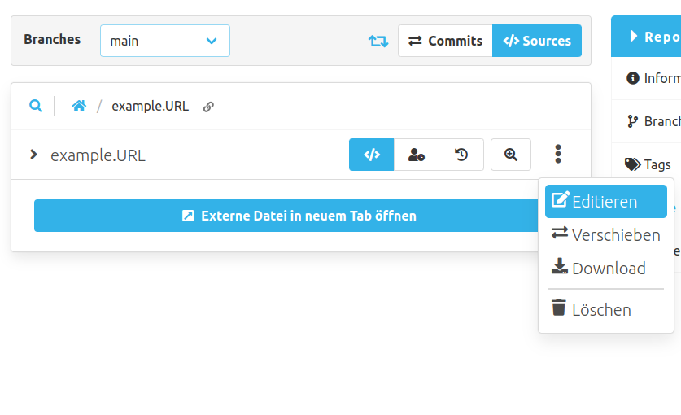
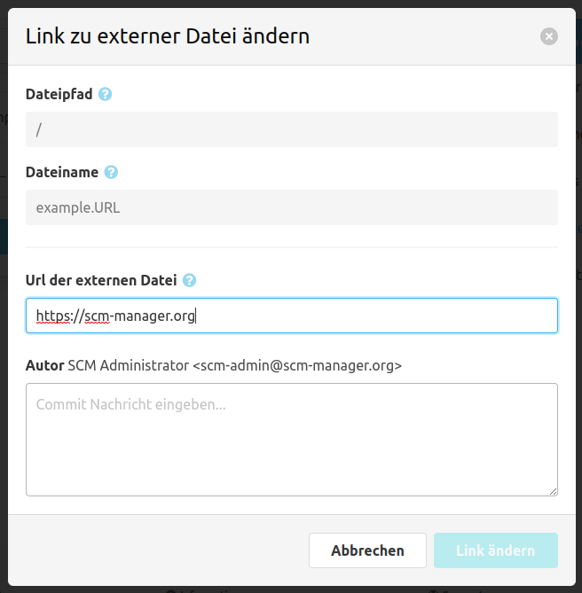

Um eine externe Datei zu erstellen, empfehlen wir die Verwendung des entsprechenden Modals. Alle externen Dateien werden als `.URL`-Dateien angelegt, die die Ziel-URL der eigentlichen Datei enthalten müssen.

Diese `URL`-Dateien werden als Ankerlinks gerendert, um die Zieldatei in einem neuen Tab zu öffnen.

Um eine externe Datei zu editieren, kann der Editieren-Button im Menü der Datei verwendet werden.

Der Dialog zum Editieren ähnelt dem fürs Erstellen, man kann jedoch lediglich die URL und die Commit-Nachricht angeben.
Die Datei kann immer noch wie jede andere Datei verschoben werden.
