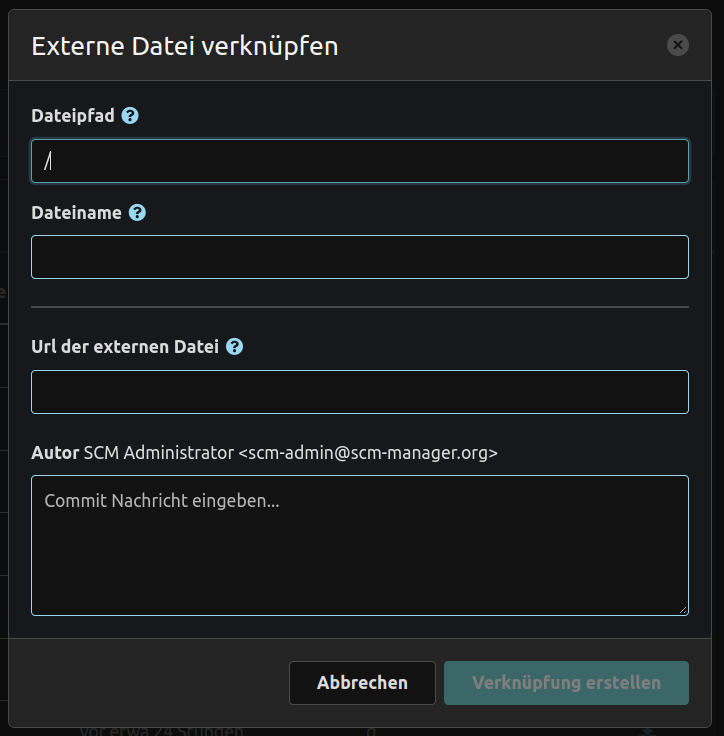
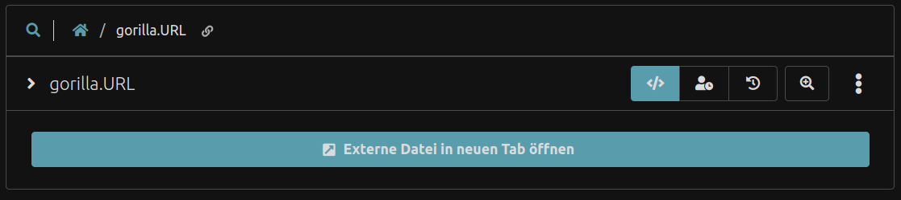

Um eine externe Datei zu erstellen, empfehlen wir die Verwendung des entsprechenden Modals. Alle externen Dateien werden als `.URL`-Dateien angelegt, die die Ziel-URL der eigentlichen Datei enthalten müssen.

Diese `URL`-Dateien werden als Ankerlinks gerendert, um die Zieldatei in einem neuen Tab zu öffnen.
