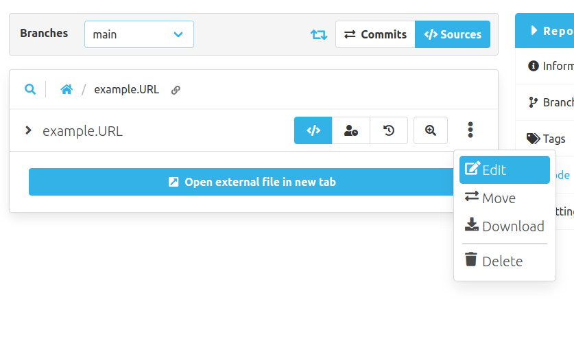
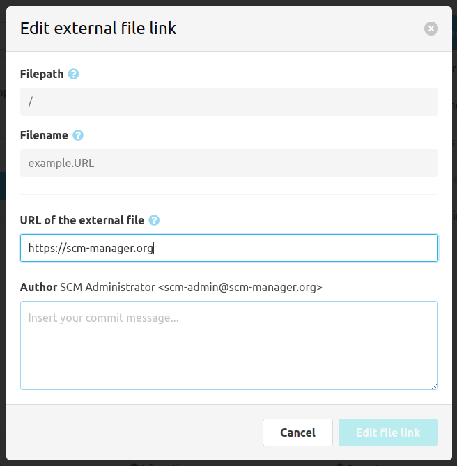

To create an external file, we recommend to use the related modal. All external files will be created as `.URL` files which must contain the target url of the actual file.

These `.URL` files will be rendered as anchor links to open the target file in a new tab.

To edit an external file, use the edit button from the file's overflow menu.

The edit dialog looks similar to the creation one, but you can only change the url and provide a commit message.
You can still move the link as you would move any other file.
