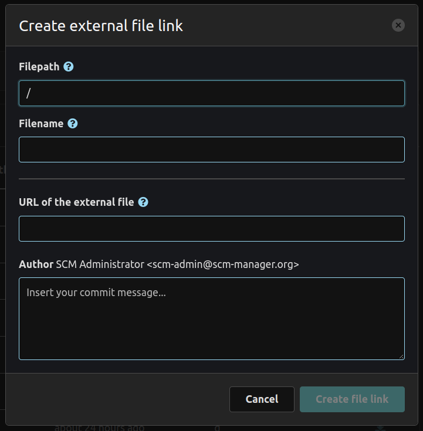
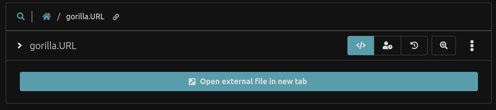

To create an external file, we recommend to use the related modal. All external files will be created as `.URL` files which must contain the target url of the actual file.

These `.URL` files will be rendered as anchor links to open the target file in a new tab.
